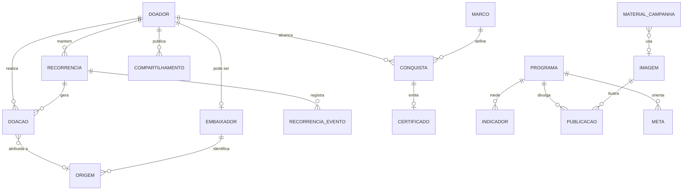

# Modelo de dados

Quinze entidades em quatro domínios. Nenhuma delas é "criança": a fronteira ética do bloco 6 do dossiê está no esquema, não numa política de uso. Fonte da verdade: `supabase/migrations/`. Este documento descreve a intenção; o SQL descreve o fato.

## Domínios e quem escreve

| Domínio | Tabelas | Quem escreve |
|---|---|---|
| Doador | `doador`, `embaixador` | o próprio (cadastro) · coordenação (ativação de embaixador) |
| Contribuição | `doacao`, `recorrencia`, `recorrencia_evento`, `origem` | funções do banco, a partir das ações do doador |
| Reconhecimento | `marco`, `conquista`, `certificado`, `compartilhamento` | funções do banco — nunca o usuário |
| Institucional | `programa`, `indicador`, `publicacao`, `imagem`, `material_campanha`, `meta` | somente a coordenação |

## Base legal, titular, acesso e retenção (regra 3 do bloco 6)

| Dado | Base legal (LGPD art. 7º) | Titular | Acesso | Retenção |
|---|---|---|---|---|
| Perfil do doador (nome, e-mail) | V — execução de contrato | doador | próprio; coordenação | 5 anos após a última doação |
| Consentimentos de comunicação e de exibição do nome | I — consentimento | doador | próprio | até revogação |
| Doações, recorrência e eventos | V — execução de contrato | doador | próprio; coordenação. **Nunca outro doador** | 5 anos após a última doação (documento fiscal) |
| Origem (embaixador, canal, data) | IX — legítimo interesse | doador referido | coordenação; embaixador só em agregado | 5 anos |
| Conquistas e certificados | V — execução de contrato | doador | próprio; verificação pública só por número | permanente (registro) |
| Compartilhamentos | IX — legítimo interesse | doador | próprio; coordenação | 2 anos |
| Programas, indicadores, publicações, imagens, materiais, metas | — sem dado pessoal | Instituto | todo autenticado; `publico = true` também sem login | permanente |

**Não é armazenado:** CPF, dados de cartão (só `meio_ref` descritivo), telefone, IP, qualquer atributo de criança atendida.

## Regras que o banco impõe

- `recorrencia.valor_centavos` entre 2.500 e 50.000 (R$ 25–500, escala do Figma); uma recorrência ativa por doador (índice parcial único).
- `indicador.periodo` é sempre o 1º dia do mês; `(programa, periodo, tipo)` único; `valor >= 0`.
- `imagem.ilustrativa = true` obrigatório enquanto `autorizacao_ref` for nulo.
- `certificado` e `conquista` são imutáveis (trigger) e só nascem por função.
- `doacao` nunca é excluída: estorno é status; doador é anonimizado (`fn_anonimizar_doador`), não apagado.

## Views (leitura) e funções (escrita)

| Objeto | Para quem | O que devolve |
|---|---|---|
| `v_continuidade` | o próprio | meses consecutivos, primeira/última doação, total (próprio) |
| `v_trilha`, `v_conquistas`, `v_proximo_marco` | o próprio | marcos com estado, datas, certificado, progresso ao próximo |
| `v_historico` | o próprio | linha do tempo de contribuições |
| `v_feed`, `v_indicadores_periodo`, `v_indicadores_resumo` | autenticado (público quando marcado) | publicações e indicadores agregados |
| `v_doacoes_mes`, `v_meta_progresso` | autenticado e anônimo | totais mensais e progresso de metas — nunca por pessoa |
| `v_rede_embaixador`, `v_rede_origem_canal`, `v_materiais_embaixador` | o próprio embaixador; coordenação | conversão e origem por canal, materiais com o link injetado |
| `fn_doar_unica`, `fn_iniciar_recorrencia`, `fn_alterar_recorrencia`, `fn_pausar_recorrencia`, `fn_retomar_recorrencia`, `fn_cancelar_recorrencia` | doador autenticado | US-01 e US-02 |
| `fn_emitir_certificado`, `fn_registrar_compartilhamento` | doador autenticado | US-04 |
| `fn_registrar_origem` (anônimo), `fn_vincular_origem` | link do embaixador | US-05 e landing pública |
| `fn_verificar_certificado` | anônimo | validação pública sem dado pessoal |
| `fn_processar_cobrancas` | `service_role` (job) | cobrança simulada |
| `fn_conceder_marco`, `fn_anonimizar_doador` | coordenação | administração |

## Continuidade: como os meses são contados

Um mês conta quando tem ao menos uma doação confirmada. Uma **pausa** registrada em `recorrencia_evento` cobre os meses seguintes sem quebrar a sequência — e sem somar. **Cancelamento** ou simples ausência de doação quebram a sequência a partir do mês seguinte. A sequência só está viva se o último mês coberto é o corrente ou o anterior.

| Marco | Critério | Fonte |
|---|---|---|
| Primeiro Passo | primeira doação confirmada | brainstorm do produto |
| Impacto Contínuo | 3 meses consecutivos | brainstorm do produto |
| Raízes Fortes | 6 meses consecutivos | brainstorm do produto |
| Guardião da Comunidade | 12 meses consecutivos | brainstorm do produto |
| Guardião da Educação | 24 meses consecutivos — "um ciclo completo do programa de reforço" | telas Minha Jornada e Certificado do Figma |

Cada conquista emite o certificado na mesma transação (`trg_conquista_certificado`), com número sequencial `EC-<ano>-<nnnnnn>` e data de emissão igual à da conquista.

## Pausa com prazo

`fn_pausar_recorrencia(p_meses)` aceita 1, 2 ou 3 meses (ou nenhum prazo) e grava `recorrencia.retomar_em`. O job `fn_processar_cobrancas` retoma automaticamente as pausas vencidas antes de cobrar. Alterar valor ou frequência nunca move a data da próxima cobrança: a mudança vale "a partir da próxima cobrança", como a tela promete.

## Painel de impacto

`fn_painel_impacto(ano | período, programa)` define a semântica de agregação — e o front apenas exibe:

- **crianças atendidas** = valor do mês mais recente da janela (contagem não se soma entre meses);
- **horas e atividades** = soma dos meses;
- **frequência média** = média dos meses.
